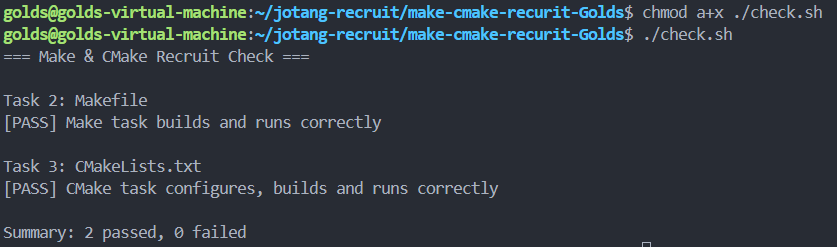

# Task 4：思考题

## 1. Make 和简单的 build.sh 有什么区别？

Make 会根据目标文件与依赖文件的时间戳判断哪些目标需要重新构建，因此只会重新编译受影响的部分；而简单的 build.sh 通常只是按顺序执行写好的编译命令，每次运行都会重复执行所有编译步骤。

## 2. CMake 是编译器吗？

CMake 本身不是编译器，它主要负责根据项目配置生成和组织构建系统，例如 Makefile 或 Ninja 构建文件。执行 cmake --build build 时，CMake 会调用底层构建工具，再由实际编译器完成编译；在当前环境中，真正编译 C 源文件的是 GCC。

## 3. 为什么不希望每次都重新编译所有 `.c` 文件？

如果项目中有很多源文件，每次都全部重新编译会浪费大量时间，而且没有修改的文件通常没有必要重复编译。只重新编译受修改影响的部分可以明显提高构建效率。

